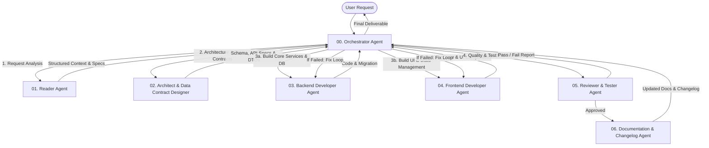

# Multi-Agent Architecture Framework (Personal OS & Software Engineering)

Hệ thống Multi-Agent được thiết kế theo mô hình **Hub-and-Spoke (Orchestrator-Centric)** để hỗ trợ phát triển phần mềm toàn trình từ ý tưởng, phân tích yêu cầu, thiết kế kiến trúc, lập trình Backend/Frontend cho đến kiểm thử và viết tài liệu/changelog.

---

## 1. Danh sách Sub-Agents & Cấu hình Model Tier

| STT | Agent | Tên File Config / System Prompt | Vai trò chính | Recommended Model & Reasoning Tier |
|---|---|---|---|---|
| 0 | **Orchestrator Agent** | `00_orchestrator.md` | Điều phối chính, phân rã công việc, quản lý luồng handoff, theo dõi tiến độ & giải quyết xung đột | **Gemini 3.7 Flash (High Thinking)** |
| 1 | **Reader Agent** | `01_reader.md` | Trích xuất yêu cầu, đọc hiểu context dự án, phân tích code hiện tại, tóm tắt specification | **Gemini 3.7 Flash (Low Thinking)** |
| 2 | **Architect & Data Contract Designer** | `02_architect_contract.md` | Thiết kế kiến trúc tổng thể, ERD/Database Schema, API Contracts (OpenAPI/TypeScript Types), Event Schemas | **Gemini 3.7 Flash (High Thinking)** |
| 3 | **Backend Developer Agent (BE)** | `03_backend.md` | Lập trình Backend (Controllers, Services, Repositories, Database Migrations, API Endpoints) | **Gemini 3.7 Flash (Medium Thinking)** |
| 4 | **Frontend Developer Agent (FE)** | `04_frontend.md` | Lập trình Frontend (UI Components, State Management, Page Layouts, Styling, API Integration) | **Gemini 3.7 Flash (Medium Thinking)** |
| 5 | **Reviewer & Tester Agent** | `05_reviewer_tester.md` | Review chất lượng code, viết Unit/Integration Tests, kiểm tra bảo mật, cấp duyệt Quality Gate | **Gemini 3.7 Flash (High Thinking)** |
| 6 | **Documentation & Changelog Agent** | `06_docs_changelog.md` | Cập nhật tài liệu kỹ thuật (Architecture Docs, API Specs, User Manual) và ghi vết `CHANGELOG.md` | **Gemini 3.7 Flash (Low Thinking)** |

---

## 2. Quy trình Luồng làm việc (Workflow & Handoff Pipeline)



---

## 3. Quy tắc Giao tiếp giữa các Agent (Inter-Agent Data Contract)

Mọi trao đổi giữa **Orchestrator** và các **Sub-Agent** đều thông qua định dạng chuẩn JSON Payload để đảm bảo tính minh bạch, khả năng ghi log và truy vết:

```json
{
  "task_id": "TASK-20260824-001",
  "from_agent": "Orchestrator",
  "to_agent": "Architect_Agent",
  "step": "DESIGN_API_CONTRACT",
  "context": {
    "feature_name": "Task Management Module",
    "specification_ref": "Personal OS — Product & Technical Specification v0.1.md # Section 9",
    "constraints": ["PostgreSQL", "Prisma ORM", "TypeScript REST API"]
  },
  "deliverables_required": [
    "Database Prisma Schema",
    "TypeScript Interfaces (Request/Response DTOs)",
    "API Endpoint Route Specifications"
  ]
}
```

---

## 4. Quy tắc An toàn & Nguyên tắc Hoạt động (Guardrails)

1. **Single Source of Truth**: Data Contracts (từ Agent 02) là tiêu chuẩn bất biến mà cả Backend (Agent 03) và Frontend (Agent 04) phải tuân thủ nghiêm ngặt.
2. **Quality Gate Compliance**: Không mã nguồn nào được đẩy vào Production hoặc ghi nhận hoàn thành nếu chưa đi qua bước duyệt từ **Reviewer & Tester Agent (Agent 05)**.
3. **No Direct Sub-Agent Intercommunication**: Các sub-agent không giao tiếp trực tiếp ngang hàng mà luôn thông qua **Orchestrator** để giữ trạng thái dự án tập trung.
4. **Idempotency & Atomic Execution**: Mỗi sub-agent nhận nhiệm vụ rõ ràng, có kết quả đầu ra đo lường được và không tạo hiệu ứng phụ ngoài phạm vi được phân công.
