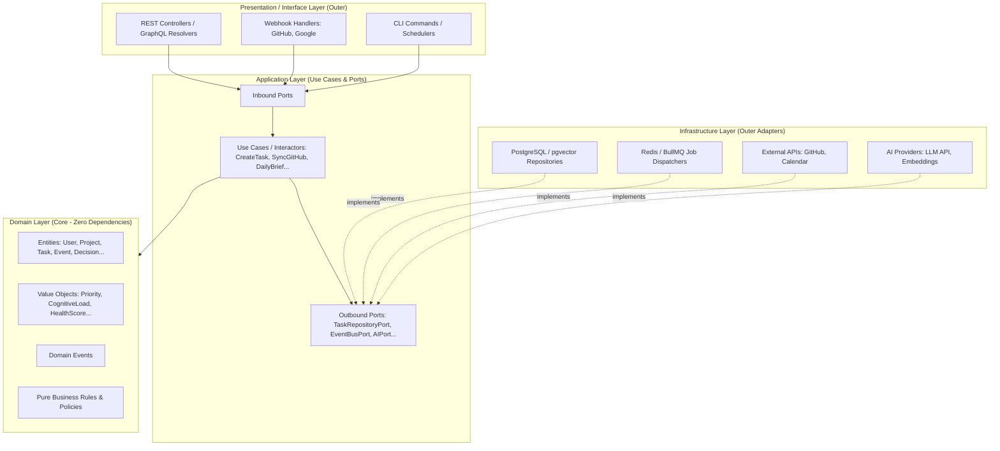

# Personal OS — Technical Architecture & Strategy

## 1. High-Level Architecture (Clean Architecture)

Hệ thống được thiết kế theo mô hình **Monorepo** với Backend tuân thủ nghiêm ngặt nguyên lý **Clean Architecture (Hexagonal Architecture / Ports & Adapters)** và Frontend Next.js hiện đại:



### Dependency Rule (Quy tắc phụ thuộc)
> Hướng phụ thuộc luôn chỉ từ **ngoài vào trong**.
> - **Domain Layer** không phụ thuộc vào bất kỳ thư viện, database hay framework nào.
> - **Application Layer** chỉ phụ thuộc vào Domain Layer.
> - **Infrastructure & Presentation** phụ thuộc vào Application Ports và Domain Entities.

---

## 2. Backend Directory Structure (`apps/api`)

Backend áp dụng Clean Architecture phân tách rõ rệt:

```text
apps/api/src/
├── core/
│   ├── domain/                         # DOMAIN LAYER (Zero external dependencies)
│   │   ├── entities/                   # User, Project, Task, Event, Decision, Recommendation...
│   │   ├── value-objects/              # Priority, CognitiveLoad, ProjectHealth, TaskStatus...
│   │   ├── exceptions/                 # DomainException, TaskOverdueException...
│   │   └── events/                     # TaskCreatedDomainEvent, ProjectStatusChangedEvent...
│   │
│   └── application/                    # APPLICATION LAYER (Use Cases & Ports)
│       ├── ports/
│       │   ├── in/                     # Inbound Ports (Use Case Interfaces)
│       │   │   ├── task.use-cases.ts
│       │   │   ├── project.use-cases.ts
│       │   │   └── daily-brief.use-cases.ts
│       │   └── out/                    # Outbound Ports (Driven Interfaces)
│       │       ├── task-repository.port.ts
│       │       ├── project-repository.port.ts
│       │       ├── vector-store.port.ts
│       │       ├── event-bus.port.ts
│       │       └── ai-service.port.ts
│       ├── use-cases/                  # Concrete Use Case Interactors
│       │   ├── tasks/                  # CreateTaskUseCase, UpdateTaskStatusUseCase...
│       │   ├── projects/               # CalculateProjectHealthUseCase...
│       │   ├── sync/                   # SyncGitHubActivityUseCase, SyncCalendarUseCase...
│       │   └── intelligence/           # GenerateDailyBriefUseCase, GenerateRecommendationsUseCase...
│       └── dtos/                       # Command/Query DTOs & Mappers
│
├── infrastructure/                     # INFRASTRUCTURE LAYER (Adapters & External Drivers)
│   ├── persistence/
│   │   ├── prisma/                     # Prisma schema, client & migrations
│   │   └── repositories/               # PrismaTaskRepository (implements TaskRepositoryPort)
│   ├── connectors/
│   │   ├── github/                     # GitHubApiClient (implements GitHubSyncPort)
│   │   └── calendar/                   # GoogleCalendarClient (implements CalendarSyncPort)
│   ├── ai/
│   │   ├── openai/                     # OpenAiServiceAdapter (implements AIServicePort)
│   │   └── vector/                     # PgVectorStoreAdapter (implements VectorStorePort)
│   ├── queue/
│   │   ├── redis/                      # Redis connection
│   │   └── bullmq/                     # BullMQ workers (SyncWorker, EmbeddingWorker)
│   └── events/
│       └── event-bus.adapter.ts        # Node Event Emitter / Redis PubSub Adapter
│
└── presentation/                       # PRESENTATION / INTERFACE LAYER (Primary Adapters)
    ├── http/
    │   ├── controllers/                # REST Controllers (Express/Fastify/Koa)
    │   ├── middlewares/                # AuthMiddleware, LoggingMiddleware, RateLimiter
    │   └── guards/                     # Authorization & Scope Guards
    ├── graphql/                        # GraphQL Schemas & Resolvers
    └── webhooks/                       # GitHubWebhookHandler, GoogleWebhookHandler
```

---

## 3. Technical Stack

| Lớp (Layer) | Công nghệ lựa chọn | Vai trò & Lý do |
|---|---|---|
| **Monorepo** | Turborepo + pnpm | Quản lý workspaces (`apps/web`, `apps/api`, `packages/*`), tối ưu caching |
| **Backend Core** | TypeScript (Clean Architecture) | Tách biệt hoàn toàn Domain & Application khỏi framework |
| **HTTP Engine** | Fastify / Express | High performance HTTP server làm presentation adapter |
| **Frontend** | Next.js (React 19), Tailwind CSS, shadcn/ui | UI phản hồi nhanh, SSR/SSG tối ưu, component system hiện đại |
| **Database** | PostgreSQL 16+ với `pgvector` | Hợp nhất Relational data (ACID) + JSONB metadata + Vector embeddings trong một DB |
| **ORM / Query Builder** | Prisma ORM | Type-safe persistence adapter, migration tự động |
| **Queue / Cache** | Redis + BullMQ | Background jobs (sync connectors, batch embeddings, daily cron) |
| **AI Integration** | OpenAI / Gemini API (Structured Outputs) | Sinh Daily Brief, trích xuất dữ liệu, semantic retrieval, rule-based recommendation |

---

## 4. Database & Storage Strategy

- **Relational Tables**: `users`, `projects`, `tasks`, `events`, `decisions`, `integrations`, `notifications`, `audit_logs`.
- **JSONB Fields**: Dùng cho `events.payload`, `integrations.config`, `recommendations.evidence`, `automations.rule_config`.
- **Vector Columns**: Lưu trữ embedding vector (1536 dims) trực tiếp trong các bảng `documents`, `journal_entries`, `decisions`, `project_memories` sử dụng `pgvector` index HNSW.

---

## 5. AI Context Pipeline (RAG Architecture)

Để đảm bảo bảo mật và tránh gửi thừa dữ liệu cho LLM:

```text
User Request / Scheduled Trigger
      ↓
Intent & Entity Resolution (Inbound Port)
      ↓
Permission & Scope Filtering (Application Policy Guard)
      ↓
Hybrid Retrieval (Outbound Port: PostgreSQL FTS + pgvector Cosine Similarity)
      ↓
Structured Context Builder (Tạo context domain object ngắn gọn)
      ↓
LLM Inference (Outbound Port: AIServicePort → Structured JSON Output)
      ↓
Audit Log & Safe Action Execution (Human Approval nếu impact lớn)
```
