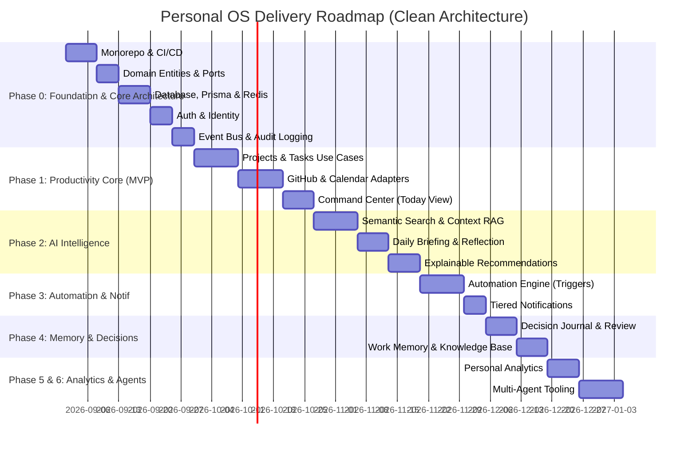

# Personal OS — Epics & User Stories Breakdown

Tài liệu này phân rã toàn bộ bản đặc tả [Personal OS — Product & Technical Specification v0.1.md](file:///home/shinki/projects/personal-os/Personal%20OS%20%E2%80%94%20Product%20&%20Technical%20Specification%20v0.1.md) thành các **Phase**, **Epic**, và **User Story** cụ thể kèm **Acceptance Criteria (AC)** để phục vụ phát triển theo chuẩn **Clean Architecture (Hexagonal Architecture)**.

---

## 🗺️ Lộ trình triển khai tổng quan (Phases Overview)

---

# PHASE 0 — Foundation & Clean Architecture Core

> **Mục tiêu**: Thiết lập Monorepo, cấu trúc phân tầng Clean Architecture (`core/domain`, `core/application`, `infrastructure`, `presentation`), Database relational + vector, Cache/Queue, Identity & Authentication, Event Schema và Audit Log Framework.

---

### Epic 0.1: Monorepo Architecture & Base Setup
- **Mã Epic**: `EPIC-001`
- **Mô tả**: Cấu hình Monorepo (pnpm workspaces / Turborepo) chia tách rõ ràng giữa Web (`apps/web`), API backend (`apps/api`), Shared libraries (`packages/shared`, `packages/types`, `packages/config`).

#### Stories:
1. **US-001: Khởi tạo Monorepo Workspace & Clean Arch Folder Layout**
   - *Là* Developer, *tôi muốn* có cấu trúc thư mục monorepo chuẩn với backend chia rõ các tầng Domain, Application, Infrastructure, Presentation.
   - **AC:**
     - `pnpm build`, `pnpm lint`, `pnpm test` chạy thành công từ root repo.
     - `apps/api` có cấu trúc: `src/core/domain/`, `src/core/application/`, `src/infrastructure/`, `src/presentation/`.
     - `apps/web` (Next.js), `packages/types`, `packages/shared` được cấu hình liên kết chuẩn.
2. **US-002: Thiết lập Packages dùng chung (`types` & `shared`)**
   - *Là* Developer, *tôi muốn* định nghĩa các TypeScript interfaces, DTOs, Enums dùng chung cho cả BE và FE để đảm bảo Single Source of Truth.
   - **AC:**
     - `packages/types` export các model cơ bản (`User`, `Project`, `Task`, `Event`, `Decision`).
     - Frontend và Backend import trực tiếp các types này mà không bị lỗi module resolution.

---

### Epic 0.2: Database & Infrastructure Adapters
- **Mã Epic**: `EPIC-002`
- **Mô tả**: Thiết lập cơ sở dữ liệu PostgreSQL kèm extension `pgvector`, Persistence Adapter (Prisma Repositories), Redis cache và BullMQ queue cho background jobs.

#### Stories:
1. **US-003: Cấu hình Docker Compose cho Local Environment**
   - *Là* Developer, *tôi muốn* khởi chạy nhanh PostgreSQL (kèm `pgvector`) và Redis bằng 1 lệnh `docker compose up`.
   - **AC:**
     - File `docker-compose.yml` định nghĩa service `postgres` (phiên bản hỗ trợ `pgvector`) và `redis`.
     - Healthcheck cho cả 2 database services hoạt động ổn định.
2. **US-004: Thiết lập Prisma Persistence Adapter & Migrations**
   - *Là* Backend Dev, *tôi muốn* cấu hình Prisma ORM trong tầng Infrastructure, cài đặt các Repositories hiện thực hóa Outbound Ports của Application Layer.
   - **AC:**
     - `prisma migrate dev` chạy thành công.
     - Repositories (ví dụ: `PrismaTaskRepository`) implement đầy đủ interface `TaskRepositoryPort`.
     - Kích hoạt extension `pgvector` thông qua SQL migration ban đầu.
3. **US-005: Cấu hình BullMQ Queue & Worker Adapter Layer**
   - *Là* Backend Dev, *tôi muốn* thiết lập module kết nối Redis và BullMQ để xử lý các background jobs (sync, email, AI embedding) qua Queue Adapter.
   - **AC:**
     - Queue Adapter có thể push job vào queue và consume job thành công với cơ chế retry có exponential backoff.

---

### Epic 0.3: Identity & Authentication
- **Mã Epic**: `EPIC-003`
- **Mô tả**: Hệ thống xác thực người dùng, bảo vệ API và quản lý phiên làm việc bảo mật.

#### Stories:
1. **US-006: User Authentication & Security Layer**
   - *Là* Người dùng, *tôi muốn* đăng ký/đăng nhập an toàn để dữ liệu cá nhân của tôi được bảo mật.
   - **AC:**
     - Use case `AuthenticateUserUseCase` xác thực email/password hoặc OAuth.
     - Presentation layer cấp phát Access Token & Refresh Token an toàn.
     - Auth Middleware / Guard bảo vệ tất cả API routes yêu cầu đăng nhập.
2. **US-007: Integration Token Encryption & Scope Management**
   - *Là* Hệ thống, *tôi muốn* mã hóa token tích hợp bên thứ ba (GitHub PAT, Google OAuth token) trong database để đảm bảo an toàn tuyệt đối.
   - **AC:**
     - Sử dụng thuật toán mã hóa đối xứng (AES-256-GCM) trước khi lưu token vào DB.
     - Không bao giờ trả token thô về client trong API response.

---

### Epic 0.4: Event Infrastructure & Audit Logging
- **Mã Epic**: `EPIC-004`
- **Mô tả**: Chuẩn hóa mô hình Event-driven và Audit Log để theo dõi mọi biến đổi dữ liệu và hành động của AI.

#### Stories:
1. **US-008: Event Bus Adapter & Domain Event Dispatcher**
   - *Là* Backend Architect, *tôi muốn* mọi thay đổi trạng thái trong Domain đều phát ra Domain Events và được Event Bus chuyển tiếp thành `Event` chuẩn.
   - **AC:**
     - `EventBusPort` được implement bởi Adapter (EventEmitter / Redis PubSub).
     - Event lưu trữ vào bảng `events` trong PostgreSQL.
2. **US-009: Audit Log Framework for Human & AI Actions**
   - *Là* Người dùng, *tôi muốn* xem lịch sử mọi hành động do AI hoặc bản thân thực hiện (`actor, action, resource, before, after, reason, timestamp`).
   - **AC:**
     - Interceptor / Middleware ghi nhận audit log cho các mutations và AI tool executions.
     - Use case truy vấn audit log hỗ trợ lọc theo ngày, resource, actor.

---

# PHASE 1 — Productivity Core (MVP Focus)

> **Mục tiêu**: Xây dựng Domain Entities, Use Cases cho Projects, Tasks, Connectors đồng bộ GitHub/Calendar và giao diện Daily Command Center.

---

### Epic 1.1: Project Management Module
- **Mã Epic**: `EPIC-010`
- **Mô tả**: Quản lý dự án, theo dõi tiến độ, milestone, tài nguyên và đo lường chỉ số sức khỏe dự án (Project Health).

#### Stories:
1. **US-010: Project Domain Entity, Use Cases & UI**
   - *Là* Người dùng, *tôi muốn* tạo, sửa, lưu trữ các Project với các thông tin: Tên, Mô tả, Trạng thái (`ACTIVE`, `PAUSED`, `COMPLETED`, `ARCHIVED`), Deadline, Tags.
   - **AC:**
     - Domain Entity `Project` chứa các logic validate trạng thái và thời hạn.
     - Use cases: `CreateProjectUseCase`, `UpdateProjectUseCase`, `ListProjectsUseCase`.
     - Giao diện UI Project List và Project Detail trên Next.js.
2. **US-011: Project Health Calculation Use Case**
   - *Là* Người dùng, *tôi muốn* hệ thống tính toán chỉ số sức khỏe dự án (Progress, Momentum, Schedule Risk, Blocker Risk) dựa trên dữ liệu thực tế.
   - **AC:**
     - Use case `CalculateProjectHealthUseCase` tính điểm dựa trên: % task hoàn thành, số task quá hạn, commit frequency, PRs pending.
     - Hiển thị widget Project Health Score trực quan trên UI.

---

### Epic 1.2: Contextual Task Management Module
- **Mã Epic**: `EPIC-011`
- **Mô tả**: Quản lý công việc thông minh, hỗ trợ chu kỳ vòng đời task, độ ưu tiên, liên kết dự án và đo lường độ tải nhận thức (Cognitive Load).

#### Stories:
1. **US-012: Task Lifecycle & Properties Management**
   - *Là* Người dùng, *tôi muốn* quản lý Task với đầy đủ thuộc tính: Title, Description, Status (`INBOX`, `PLANNED`, `IN_PROGRESS`, `BLOCKED`, `COMPLETED`, `ARCHIVED`), Priority (`LOW`, `MEDIUM`, `HIGH`, `URGENT`), Due Date, Estimated Duration, Cognitive Load (1-5), Project ID.
   - **AC:**
     - Domain Entity `Task` quản lý State Machine chuyển đổi trạng thái hợp lệ.
     - Use cases: `CreateTaskUseCase`, `TransitionTaskStatusUseCase`, `FilterTasksUseCase`.
     - UI hiển thị danh sách dạng List & Kanban view, hỗ trợ kéo thả đổi trạng thái.
2. **US-013: Task Context Linking**
   - *Là* Người dùng, *tôi muốn* một task có thể liên kết trực tiếp với GitHub PR/Issue, Google Calendar Event hoặc Email nguồn.
   - **AC:**
     - Value Object `TaskSource` lưu trữ `sourceType` và `externalReferenceId`.
     - Click vào link nguồn từ UI Task sẽ mở trực tiếp item tương ứng trên GitHub/Calendar.

---

### Epic 1.3: Data Ingestion & Connectors (GitHub & Google Calendar)
- **Mã Epic**: `EPIC-012`
- **Mô tả**: Tự động thu thập và đồng bộ dữ liệu từ các nền tảng bên ngoài vào Context Layer qua Infrastructure Adapters.

#### Stories:
1. **US-014: GitHub Sync Connector Adapter**
   - *Là* Developer, *tôi muốn* hệ thống tự động đồng bộ commits, pull requests, issues và review requests từ các repositories của tôi.
   - **AC:**
     - Adapter `GitHubConnector` (implements `ExternalSourceSyncPort`).
     - Use case `SyncGitHubActivityUseCase` chuẩn hóa dữ liệu GitHub thành `Event` và `Activity`.
     - Phát hiện PR đang bị nghẽn (waiting for review > 20h) và tạo signal cảnh báo.
2. **US-015: Google Calendar Sync Connector Adapter**
   - *Là* Người dùng, *tôi muốn* hệ thống đồng bộ lịch họp và các sự kiện trong ngày từ Google Calendar.
   - **AC:**
     - Adapter `GoogleCalendarConnector` kết nối Google Calendar API.
     - Use case `SyncCalendarEventsUseCase` tính tổng thời gian họp và các khoảng trống (Free time slots).

---

### Epic 1.4: Command Center & Today Dashboard
- **Mã Epic**: `EPIC-013`
- **Mô tả**: Giao diện tổng chỉ huy mỗi ngày, trả lời 3 câu hỏi: *"Điều gì đang xảy ra?"*, *"Điều gì quan trọng nhất?"*, *"Nên làm gì tiếp theo?"*.

#### Stories:
1. **US-016: Today View & Daily Focus Selector**
   - *Là* Người dùng, *tôi muốn* chọn tối đa 3 ưu tiên quan trọng nhất (Top 3 Daily Focus) cho ngày hôm nay và thấy chúng nổi bật ở đầu dashboard.
   - **AC:**
     - Use case `SetDailyFocusUseCase` quản lý danh sách focus tasks.
     - UI cho phép pin 3 task quan trọng vào Focus Block và theo dõi tiến độ hoàn thành.
2. **US-017: Unified Daily Schedule & Activity Timeline**
   - *Là* Người dùng, *tôi muốn* xem kết hợp lịch họp Calendar, các task dự kiến làm và dòng thời gian hoạt động (Activity Timeline) trên 1 màn hình.
   - **AC:**
     - Timeline hiển thị trực quan các block thời gian trong ngày: Meeting, Deep Work, Free Slot.
     - Feed hoạt động realtime cập nhật khi có commit mới, PR merged hoặc task xong.

---

# PHASE 2 — AI Intelligence & Context Layer

> **Mục tiêu**: Xây dựng Context Pipeline, Hybrid Search (Semantic + Keyword), quy trình tạo Daily Briefing buổi sáng, Reflection cuối ngày và Engine gợi ý có giải thích (Explainable Recommendations).

---

### Epic 2.1: Semantic Context & Hybrid Search Engine
- **Mã Epic**: `EPIC-020`
- **Mô tả**: Lưu trữ vector embedding bằng `pgvector`, truy xuất thông tin ngữ cảnh đa chiều (RAG) và tìm kiếm thông minh.

#### Stories:
1. **US-018: Automated Vector Embedding Pipeline**
   - *Là* Hệ thống, *tôi muốn* tự động tạo embedding cho Documents, Notes, Tasks, Decisions, Project updates khi chúng được tạo hoặc chỉnh sửa.
   - **AC:**
     - `VectorStorePort` được implement bởi `PgVectorStoreAdapter`.
     - Use case `GenerateEmbeddingsUseCase` xử lý embedding bất đồng bộ qua LLM Embedding API.
2. **US-019: Hybrid Search (Full-Text + Vector Similarity + Reranking)**
   - *Là* Người dùng, *tôi muốn* tìm kiếm bằng ngôn ngữ tự nhiên và nhận được kết quả chính xác cả về từ khóa lẫn ngữ nghĩa.
   - **AC:**
     - Use case `HybridSearchUseCase` kết hợp PostgreSQL FTS (`tsvector`) và Vector Cosine Distance (`<=>`).
     - Trả về danh sách thực thể liên quan nhất kèm điểm similarity score.

---

### Epic 2.2: Daily Intelligence Pipeline
- **Mã Epic**: `EPIC-021`
- **Mô tả**: Tự động sinh báo cáo Daily Brief lúc 05:00–06:00 sáng và Reflection lúc 21:00 tối.

#### Stories:
1. **US-020: Morning Daily Brief Generator (05:00 - 06:00)**
   - *Là* Người dùng, *tôi muốn* mỗi sáng nhận được bản tóm tắt súc tích: Lịch trình hôm nay, Deadline cận kề, Các nguy cơ xung đột thời gian, và 3 gợi ý hành động.
   - **AC:**
     - Cron scheduler kích hoạt `GenerateDailyBriefUseCase`.
     - Use case thu thập context 24h qua và gọi `AIServicePort` để sinh structured `DailyBrief`.
     - Hiển thị Daily Brief trang trọng trên trang Today khi người dùng mở ứng dụng.
2. **US-021: End-of-Day Review & Reflection (21:00)**
   - *Là* Người dùng, *tôi muốn* cuối ngày hệ thống so sánh kế hoạch đã đặt ra với kết quả thực tế, phát hiện việc chưa xong và gợi ý chuẩn bị cho ngày mai.
   - **AC:**
     - Use case `GenerateDailyReflectionUseCase` đối soát planned vs actual tasks.
     - Tạo bản ghi Reflection giúp người dùng ghi chú cảm nhận nhanh (1-click sentiment).

---

### Epic 2.3: Explainable AI Recommendation Engine
- **Mã Epic**: `EPIC-022`
- **Mô tả**: Đưa ra các khuyến nghị thông minh dựa trên kết hợp Rules + Thống kê + LLM Reasoning với đầy đủ bằng chứng giải thích.

#### Stories:
1. **US-022: Workload & Conflict Detection Engine**
   - *Là* Người dùng, *tôi muốn* nhận cảnh báo khi ngày làm việc có cognitive load quá cao hoặc trùng lặp giữa deadline lớn và nhiều cuộc họp.
   - **AC:**
     - Use case `DetectWorkloadRisksUseCase` áp dụng rule: Tổng thời gian họp > 4h VÀ có >= 2 high-load tasks có deadline hôm nay.
     - Tạo Domain Entity `Recommendation` loại `workload_risk` kèm lý do rõ ràng.
2. **US-023: Recommendation Card with Action Approval (Human-in-the-loop)**
   - *Là* Người dùng, *tôi muốn* mỗi gợi ý của AI đều có nút hành động cụ thể (ví dụ: *"Dời task X sang ngày mai"*, *"Tạo follow-up issue"*) và chỉ thực thi khi tôi bấm duyệt.
   - **AC:**
     - Card hiển thị: Title, Reason, Evidence, Confidence Score (%), Action Button.
     - Bấm nút sẽ gọi Use case thực thi hành động tương ứng và ghi log audit.

---

# PHASE 3 — Automation Engine & Notification System

> **Mục tiêu**: Xây dựng engine tự động hóa theo cơ chế Event-Driven (Trigger - Condition - Action) và phân loại thông báo theo 4 cấp độ.

---

### Epic 3.1: Event-Driven Automation Engine
- **Mã Epic**: `EPIC-030`
- **Mô tả**: Cho phép thiết lập các luồng tự động hóa dựa trên event từ hệ thống hoặc bên thứ ba.

#### Stories:
1. **US-024: Automation Rule Management & Trigger Matching**
   - *Là* Người dùng, *tôi muốn* tạo các rule tự động: *Khi sự kiện X xảy ra (Trigger), nếu thỏa điều kiện Y (Condition), thì thực hiện hành động Z (Action)*.
   - **AC:**
     - Hỗ trợ các trigger: `github.pull_request.merged`, `calendar.event.ended`, `task.overdue`, `schedule.cron`.
     - Hỗ trợ các action: `create_task`, `send_notification`, `update_project_status`, `log_memory`.
2. **US-025: Automation Execution Engine & Safe Retry**
   - *Là* Hệ thống, *tôi muốn* thực thi các action tự động trong môi trường bảo mật, có giới hạn tài nguyên và log kết quả chi tiết.
   - **AC:**
     - Use case `ExecuteAutomationActionUseCase` thực thi action độc lập.
     - Ghi nhận trạng thái thực thi (`SUCCESS`, `FAILED`), lưu output payload và audit log.

---

### Epic 3.2: Tiered Notification Engine
- **Mã Epic**: `EPIC-031`
- **Mô tả**: Quản lý thông báo theo 4 mức độ: Critical, Important, Informational, Silent để tránh spam và giảm áp lực nhận thức.

#### Stories:
1. **US-026: Tiered Notification Classification & Delivery**
   - *Là* Người dùng, *tôi muốn* chỉ nhận notification tức thì cho việc thực sự khẩn cấp (`Critical`), việc quan trọng (`Important`) vào khung giờ tập trung, còn việc phụ (`Silent`/`Info`) chỉ lưu log âm thầm.
   - **AC:**
     - Domain Entity `Notification` phân loại rõ 4 tiers.
     - Presentation layer cung cấp UI Notification Center hỗ trợ lọc theo tier.

---

# PHASE 4 — Memory, Decisions & Knowledge Workspace

> **Mục tiêu**: Bộ nhớ dài hạn cho công việc (Work Memory), sổ nhật ký quyết định (Decision Journal) kèm vòng lặp đánh giá kết quả, và không gian nghiên cứu.

---

### Epic 4.1: Decision Journal & Feedback Learning Loop
- **Mã Epic**: `EPIC-040`
- **Mô tả**: Ghi lại các quyết định kỹ thuật / kinh doanh, dự đoán kết quả, đặt lịch review và để AI đánh giá chất lượng quyết định.

#### Stories:
1. **US-027: Decision Recording & Hypothesis Schema**
   - *Là* Người dùng, *tôi muốn* ghi lại quyết định cùng: Bối cảnh, Các lựa chọn đã cân nhắc, Lý do chọn, Giả định (Assumptions), Kết quả mong đợi và Ngày hẹn đánh giá lại (`reviewDate`).
   - **AC:**
     - Domain Entity `Decision` và Use case `RecordDecisionUseCase`.
     - Tự động gắn nhãn và lưu trữ vào Decision Store.
2. **US-028: Decision Review & AI Outcome Evaluation**
   - *Là* Người dùng, *tôi muốn* khi đến ngày `reviewDate`, hệ thống nhắc tôi nhập kết quả thực tế và AI sẽ so sánh với dự đoán ban đầu để rút ra bài học.
   - **AC:**
     - Use case `EvaluateDecisionOutcomeUseCase` đối chiếu expected vs actual outcome.
     - AI phân tích: Độ chính xác của giả định, tác động thực tế, bài học đề xuất.

---

### Epic 4.2: Work Memory & Knowledge Base
- **Mã Epic**: `EPIC-041`
- **Mô tả**: Lưu trữ tri thức dài hạn về dự án, kiến trúc (ADRs), giải pháp cho sự cố và tài liệu nghiên cứu.

#### Stories:
1. **US-029: Project Memory & ADR Management**
   - *Là* Developer, *tôi muốn* ghi lại các quyết định kiến trúc (Architecture Decision Records) và sự cố/giải pháp (Incident postmortems) gắn liền với từng Project.
   - **AC:**
     - Use case `SaveProjectMemoryUseCase` lưu trữ ADR và technical notes.
     - Tìm kiếm ngữ nghĩa có thể truy vấn lại giải pháp từ các sự cố quá khứ.
2. **US-030: Research Paper & Reference Workspace**
   - *Là* Knowledge Worker, *tôi muốn* lưu trữ tài liệu tham khảo/papers, trích xuất tóm tắt chính và AI gợi ý liên kết tới dự án đang làm.
   - **AC:**
     - Entity `ResearchPaper` (Title, Authors, Abstract, Notes, PDF link).
     - AI tự động trích xuất key insights và liên kết vào Knowledge Graph.

---

# PHASE 5 & 6 — Personal Analytics & Autonomous Agents

> **Mục tiêu**: Phân tích hành vi & hiệu suất cá nhân toàn diện, và mở rộng hệ thống sang mô hình Multi-Agent tự trị có kiểm soát.

---

### Epic 5.1: Personal & Productivity Analytics
- **Mã Epic**: `EPIC-050`
- **Mô tả**: Đo lường thời gian thực tế dành cho Deep Work, Meetings, Admin, Learning; đánh giá xu hướng hiệu suất.
- **Stories:**
  - **US-031**: Weekly Overview Dashboard (Tỷ lệ phân bổ thời gian Deep Work vs Meetings).
  - **US-032**: Cognitive Load Balance Trends (Cảnh báo nguy cơ kiệt sức/quá tải dài hạn).

---

### Epic 6.1: Multi-Agent Tooling & Autonomous Workflows
- **Mã Epic**: `EPIC-060`
- **Mô tả**: Hệ thống các Sub-Agents chuyên trách (Planner, Research, Project, Communication) hoạt động trên nền tảng Tool Calling, Policy Sandbox và Audit Log.
- **Stories:**
  - **US-033**: Agent Tool Sandbox with Strict Policy Check (Cơ chế phân quyền trước khi thực thi tool).
  - **US-034**: Automated Action Preview & Confirmation Dialog (Xem trước thay đổi trước khi AI thực thi).

---

## 📊 Ma trận bàn giao giữa 7 Sub-Agents theo chuẩn Clean Architecture

| Giai đoạn | Agent 01 (Reader) | Agent 02 (Architect) | Agent 03 (BE Dev - Clean Arch) | Agent 04 (FE Dev) | Agent 05 (Reviewer/Tester) | Agent 06 (Docs) |
|---|---|---|---|---|---|---|
| **Phase 0** | Trích xuất spec `Section 24-28` | Thiết kế Domain Entities, In/Out Ports, DB Schema, Event Schema | Code Domain Entities, Use Cases, Prisma Adapters, Auth API | Khởi tạo Next.js, Tailwind, Base Layout | Viết Invariant tests, test Domain logic & Repositories | Cập nhật `docs/decisions/`, `docs/setup.md` |
| **Phase 1** | Trích xuất spec `Section 8-10, 23` | Thiết kế DTOs cho Task, Project, GitHub/Cal Ports | Code Task/Project Use Cases, GitHub/Cal Ingestion Adapters | Lập trình UI Today Dashboard, Task Kanban | Viết Unit tests cho Use Cases & Integration tests Adapters | Cập nhật User Guide & `CHANGELOG.md` |
| **Phase 2** | Trích xuất spec `Section 17-19, 31-34` | Thiết kế Vector Port & AI Service Port | Code RAG Pipeline, Brief Use Case, Rec Engine Adapter | Lập trình Daily Brief Card, Rec Approval UI | Kiểm thử độ chính xác của Brief & RAG Retrieval | Viết AI Context Architecture Docs |
| **Phase 3** | Trích xuất spec `Section 16, 20` | Thiết kế Automation Trigger/Action Ports | Code Event Bus Adapter, Automation Executor Interactor | Lập trình Automation Rule Builder UI | Kiểm thử an toàn khi chạy action tự động | Viết tài liệu Automation Cookbook |
| **Phase 4** | Trích xuất spec `Section 11-14, 21` | Thiết kế Decision Port & Memory Graph | Code Decision Review Use Case & Vector Search Adapters | Lập trình Decision Journal & Research UI | Kiểm thử tính toàn vẹn dữ liệu và Search FTS/Vector | Cập nhật ADR Guidelines |
